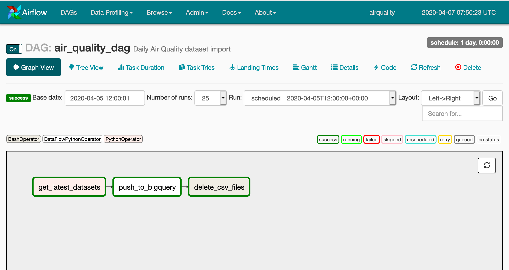
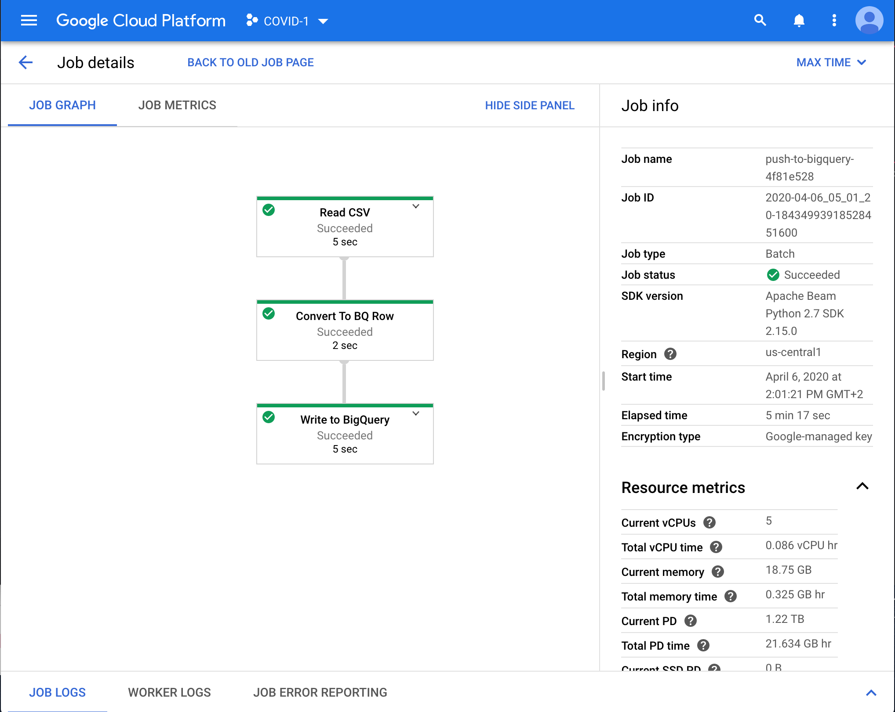

# Ingesting and analysing hourly data to study the impact of Covid-19 on air quality in France

### About the data
There are 18 associations in charge of measuring and surveilling air quality in France (metropolitain 
France and overseas territories). The data they collect is sent to the _Laboratoire Central de 
Surveillance de la Qualité de l'Air_ (LCSQA) and centralised in a national air quality database. 
The LCSQA is also in charge of 
delivering reports about the air quality in France to the European Environment Agency (EEA) in a 
well-defined format. The LCSQA has made these hourly reports available on 
[data.gouv.fr](https://www.data.gouv.fr) under an [Open Licence](https://www.etalab.gouv.fr/wp-content/uploads/2014/05/Licence_Ouverte.pdf).

Link to the datasets: [Données « temps réel » de mesure des concentrations de polluants 
atmosphériques réglementés](https://www.data.gouv.fr/fr/datasets/donnees-temps-reel-de-mesure-des-concentrations-de-polluants-atmospheriques-reglementes-1/) 
(mostly French, except for the IPR Guides)

The datasets focus on the following pollutants, as described in [this EEA document](https://www.eea.europa.eu/publications/2-9167-057-X):
* Ozone (O3), measured in µg/m3
* Carbon monoxide (CO), measured in mg/m3
* Nitrogen dioxide (NO2), measured in µg/m3
* Sulfur dioxide (SO2), measured in µg/m3
* Fine particles with a diameter of 10 micrometers or less (PM10), measured in µg/m3
* Fine particles with a diameter of 2.5 micrometers or less (PM2.5), measured in µg/m3

The European limits for each of these pollutants are described here: [European standards](https://www.airparif.asso.fr/en/reglementation/normes-europeennes)

### About the purpose of this project
The objectives of this project were manifold and of both personal and profesionnal nature, 
but the main question is: Was there a decrease in air pollutants following the French 
lockdown on March 17h 2020 due to the Covid-19 pandemic ? 

### Scripts overview

The Python files can be found in the `src` folder.  
The following scripts can be run locally, provided the environment variable DATA_FR_API_KEY is set to a data.gouv.fr API Key
* `fetch.py` : Makes API calls to data.gouv.fr to fetch the list of datasets and the contents of the datasets
* `spo_parser.py` : Downloads dataset D (sample points descriptions) in CSV format
* `zone_parser.py` : Downloads dataset B (zone descriptions) in CSV format
* `e2_parser.py` : Downloads all E2 datasets published on a given day in CSV format

The next two files are meant to automatise the work by using Google Cloud Platform tools.
* `air_quality_dag` : Creates an Airflow DAG scheduled to run once a day on Google Cloud Composer
* `air_quality_flow` : Is called by the DAG to create and run a Dataflow pipeline that imports data into BigQuery

  

  

